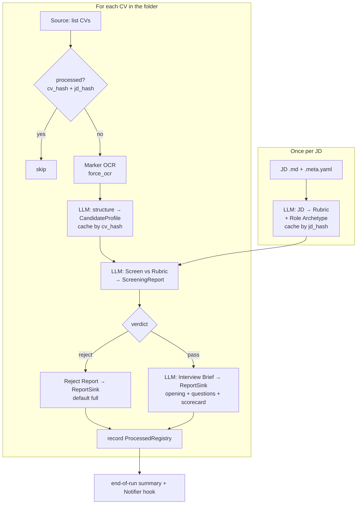

# cv-agent

A **per-candidate pipeline** that screens CVs against a job description and drafts interview
material for the candidates who pass. Each CV flows independently through
**OCR → structuring → screening → (if pass) interview prep**.

Built for messy real-world CVs (exported from platforms like boss直聘 with poisoned text layers /
watermarks and two-column layouts) and for **bring-your-own-key** LLM access, so you can run it
fully local or against any OpenAI-compatible provider.

> It is a **stateful deterministic workflow**, not a swarm of autonomous agents — hiring decisions
> must be reproducible and auditable. See [ADR 0004](./docs/adr/0004-deterministic-workflow-not-autonomous-agents.md).

## Pipeline



Screening is **evidence-based**: the JD becomes a `Rubric` of must-have / nice-to-have
`Requirement`s; the LLM scores each `Met | Partial | Unmet` with a quote; a deterministic rule
decides the verdict — **reject only if a must-have is `Unmet`** (loose default; a `Partial`
must-have passes). See [AGENT.md](./AGENT.md) for the full rule.

## Quickstart

Requires **Python ≥ 3.11** and [**uv**](https://docs.astral.sh/uv/) (does not touch your global
Python).

```bash
# 1. Install deps into a project-local .venv
uv sync

# 2. Configure
cp .env.example .env
#    edit .env — at minimum LLM_BASE_URL / LLM_API_KEY / LLM_MODEL

# 3. Add inputs
#    CVs (PDF)         -> data/cvs/
#    JD (markdown)     -> data/jds/ai-app-engineer.md  (+ optional .meta.yaml)

# 4. Run
uv run cv-agent run --jd ai-app-engineer.md
```

Need a **local** LLM on Apple Silicon? See **[vmlx/README.md](./vmlx/README.md)** — it walks through
installing vMLX, pulling a model from Hugging Face, where it's cached, and starting the
OpenAI-compatible server that `.env` points at.

## Configuration

### LLM access (BYOK, per-node)

One default model, with **optional** overrides for any of the four LLM nodes
(`STRUCTURE_CV`, `JD_RUBRIC`, `SCREEN`, `INTERVIEW`) — each can override `MODEL`, `BASE_URL`, and
`API_KEY` independently, so cheap nodes can run locally while the hardest node uses a stronger
model. Every option is listed and explained in **[.env.example](./.env.example)**.

### JD meta file (`<jd-name>.meta.yaml`)

Optional, sits next to `<jd-name>.md`. **The whole file is optional and every field is optional** —
omit it to accept all defaults / auto-detection. There are **no required fields**; a meta file only
exists to *override* defaults.

| Field | Type | Default | Meaning |
|---|---|---|---|
| `title` | string | JD filename | Display name only |
| `role_archetype` | `technical` \| `management` \| `hybrid` | auto-detected from JD | Steers interview depth vs breadth |
| `interview_format` | `technical` \| `behavioral` \| `mixed` | `mixed` | Question mix |
| `default_minutes` | int | `45` | Interview length for time allocation |
| `output_language` | string | `zh-Hant` | Language of questions / reports |
| `screening_strictness` | `loose` \| `strict` | `loose` | `loose`: a `Partial` must-have passes; `strict`: must be `Met` |

```yaml
# data/jds/ai-app-engineer.meta.yaml   (all fields optional)
title: "AI Applications Engineer"
role_archetype: technical
interview_format: technical
default_minutes: 45
output_language: zh-Hant
screening_strictness: loose
```

## Running

```bash
uv run cv-agent run [options]
uv run cv-agent list-jds          # list selectable JDs from the JD source
```

Precedence for any overlapping setting: **CLI > JD meta > `.env` > built-in default.**

| Option | Effect |
|---|---|
| `--jd FILE` | Which JD to screen against (else `DEFAULT_JD`, else interactive pick) |
| `--role`, `--format`, `--minutes`, `--lang` | Override the JD meta fields |
| `--strict` / `--loose` | Override screening strictness |
| `--no-reject-report` / `--concise-reject-report` | Trim reject output (default: full) |
| `--ocr-fallback` | Enable vision-LLM re-OCR on low-confidence pages (reserved) |
| `--round N` | Label a later interview round so its brief doesn't overwrite the first |
| `--prev-scorecard FILE` | Feed a previous round's scorecard into the new brief |
| `--max-concurrency N` | Override `MAX_CONCURRENCY` (default 1, sequential) |

### Outputs

Written to `data/reports/` (the `ReportSink`), verdict-prefixed:

- `pass__…__interview-brief.md` — opening remarks, competency-grouped questions with follow-up
  ladders grounded in the CV, a time budget, and an empty scorecard (produced **before** the
  interview; contains no answers).
- `reject__…__reject-report.md` — reject rationale (full by default; trimmable/suppressible).

The raw internal **Screening Report** stays in SQLite and is never written to the sink. A summary
(pass/reject counts, reject reasons, and any errors / manual-review flags) prints at the end of each
run.

---

## Development

### Directory structure

```text
cv-agent/
├── README.md  AGENT.md  CLAUDE.md  CONTEXT.md   # docs + glossary
├── docs/adr/                                     # architecture decision records (0001–0004)
├── pyproject.toml  .env.example  .gitignore
├── vmlx/README.md                                # local LLM hosting guide
├── data/
│   ├── cvs/         # input CV PDFs        (LocalFolderSource)
│   ├── jds/         # <name>.md + <name>.meta.yaml
│   └── reports/     # ReportSink output    (pass__ / reject__ prefixed)
├── evals/           # offline golden-CV evals (LLM semantics; not in coverage gate)
├── src/cv_agent/
│   ├── config.py    cli.py    app.py
│   ├── domain/      # Pydantic: CandidateProfile, Requirement, Rubric, ScreeningReport, InterviewBrief, RoleArchetype
│   ├── sources/     # Source port + LocalFolderSource (CV & JD)         → GoogleDriveSource later
│   ├── store/       # ProfileCache / ProcessedRegistry / RubricCache (SQLite backend)
│   ├── sinks/       # ReportSink port + LocalFolderSink                 → GoogleDriveSink later
│   ├── ocr/         # Marker wrapper (force_ocr, multi-page, confidence)
│   ├── llm/         # BYOK OpenAI-compatible client + per-node resolution + schema-validated retry
│   ├── nodes/       # structure_cv · jd_to_rubric · screen · interview_brief
│   ├── graph/       # LangGraph: per-candidate subgraph + folder fan-out
│   └── notify/      # Notifier port + NullNotifier (Slack seam, v1 no-op)
└── tests/
```

The design is **ports & adapters**: swapping folder → Google Drive, SQLite → another store, or
adding Slack means writing one adapter, not touching the pipeline.

### Testing

```bash
uv run pytest                 # unit + contract tests
uv run pytest -m "not slow"   # skip the Marker OCR integration smoke test
```

- **80% coverage gate** on the deterministic core (hashing, dedup keys, screening decision rule,
  config/CLI precedence, YAML validation, filename routing, SQLite ports, sink routing) and on the
  LLM nodes' parse/validate/retry contract (mocked client + fixtures). Core is built test-first.
- **LLM semantics** are checked by offline **evals** on a golden CV set (`evals/`), not by the
  coverage gate — model output is nondeterministic.

### Reference

- **[CONTEXT.md](./CONTEXT.md)** — domain glossary (ubiquitous language).
- **[AGENT.md](./AGENT.md)** — decision rules, config precedence, robustness, deferred seams.
- **[docs/adr/](./docs/adr/)** — why the structural choices were made.
