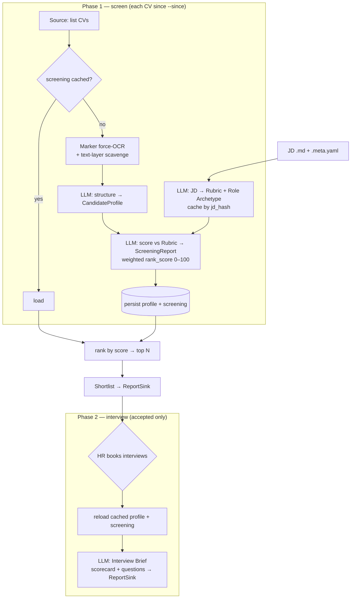

# cv-agent

A **two-phase pipeline** that ranks CVs against a job description (**screen** → a shortlist) and
then drafts interview material for the candidates HR books (**interview**). Each CV flows through
**OCR → structuring → screening → (if pass) interview prep**.

Built for messy real-world CVs (exported from platforms like boss直聘 with poisoned text layers /
watermarks and two-column layouts) and for **bring-your-own-key** LLM access, so you can run it
fully local or against any OpenAI-compatible provider.

> It is a **stateful deterministic workflow**, not a swarm of autonomous agents — hiring decisions
> must be reproducible and auditable. See [ADR 0004](./docs/adr/0004-deterministic-workflow-not-autonomous-agents.md).

## Pipeline



Screening is **evidence-based**: the JD becomes a `Rubric` of must-have / nice-to-have
`Requirement`s; the LLM scores each `Met | Partial | Unmet` with a quote. Phase 1 ranks candidates
by a weighted **`rank_score`** (0–100; must-have weighted more) and keeps the top N. See
[AGENT.md](./AGENT.md) for the scoring + verdict rules.

## Quickstart

Requires **Python ≥ 3.11** and [**uv**](https://docs.astral.sh/uv/) (does not touch your global
Python).

```bash
# 1. Install deps into a project-local .venv
uv sync

# 2. Configure
cp .env.example .env
#    edit .env — at minimum LLM_BASE_URL / LLM_API_KEY / LLM_MODEL

# 3. Add inputs
#    CVs (PDF)         -> data/cvs/   (or a Google Drive folder, CV_SOURCE=gdrive)
#    JD (markdown)     -> data/jds/ai-app-engineer.md  (+ optional .meta.yaml)

# 4a. Phase 1 — score everyone, get a ranked shortlist
uv run cv-agent screen --jd ai-app-engineer.md --since 20260818 --top 20

# 4b. Phase 2 — after HR books interviews, draft briefs for the accepted ones
uv run cv-agent interview --jd ai-app-engineer.md "陳大文 4年.pdf" "李四"
```

Need a **local** LLM on Apple Silicon? See **[vmlx/README.md](./vmlx/README.md)** — it walks through
installing vMLX, pulling a model from Hugging Face, where it's cached, and starting the
OpenAI-compatible server that `.env` points at.

## Configuration

### LLM access (BYOK, per-node)

One default model, with **optional** overrides for any of the four LLM nodes
(`STRUCTURE_CV`, `JD_RUBRIC`, `SCREEN`, `INTERVIEW`) — each can override `MODEL`, `BASE_URL`, and
`API_KEY` independently, so cheap nodes can run locally while the hardest node uses a stronger
model. Every option is listed and explained in **[.env.example](./.env.example)**.

### JD meta file (`<jd-name>.meta.yaml`)

Optional, sits next to `<jd-name>.md`. **The whole file is optional and every field is optional** —
omit it to accept all defaults / auto-detection. There are **no required fields**; a meta file only
exists to *override* defaults.

| Field | Type | Default | Meaning |
| --- | --- | --- | --- |
| `title` | string | JD filename | Display name only |
| `role_archetype` | `technical` \| `management` \| `hybrid` | auto-detected from JD | Steers interview depth vs breadth |
| `interview_format` | `technical` \| `behavioral` \| `mixed` | `mixed` | Question mix |
| `default_minutes` | int | `45` | Interview length for time allocation |
| `output_language` | string | `zh-Hant` | Language of questions / reports |
| `screening_strictness` | `loose` \| `strict` | `loose` | `loose`: a `Partial` must-have passes; `strict`: must be `Met` |
| `must_weight` | float | `2.0` | Rank-score weight for must-have requirements |
| `nice_weight` | float | `1.0` | Rank-score weight for nice-to-have requirements |

```yaml
# data/jds/ai-app-engineer.meta.yaml   (all fields optional)
title: "AI Applications Engineer"
role_archetype: technical
interview_format: technical
default_minutes: 45
output_language: zh-Hant
screening_strictness: loose
# must_weight: 2.0   # optional rank-score weights
# nice_weight: 1.0
```

### Google Drive CV source (OAuth, read-only)

To read CVs from Drive instead of a local folder, set `CV_SOURCE=gdrive`. CVs must live in
**date-named subfolders** (`/20260818/…pdf`) under one folder; `--since` keeps folders ≥ that date.
OAuth acts **as you**, so no folder sharing is needed (useful when only HR can share):

1. [Google Cloud Console](https://console.cloud.google.com) → create a project → enable the
   **Google Drive API**.
2. **Google Auth Platform** → *Audience*: User type **Internal** (a Workspace account — tokens
   don't expire) or External. → *Data access*: add scope `.../auth/drive.readonly`.
3. *Clients* → create an **OAuth client ID**, type **Desktop app** → download the JSON to
   `credentials/client_secret.json`.
4. `.env`: `CV_SOURCE=gdrive`, `GDRIVE_FOLDER_ID=<id from the folder URL>`,
   `GOOGLE_OAUTH_CLIENT_SECRET=./credentials/client_secret.json`.
5. The first `screen` run opens a browser once to consent; the token is saved to
   `credentials/token.json` and reused. `credentials/` is gitignored — never commit it.

## Running

Two phases, plus a helper. Precedence for overlapping settings: **CLI > JD meta > `.env` > default.**

```bash
uv run cv-agent list-jds                         # list selectable JDs

# Phase 1 — score every CV since a date, write ONE ranked shortlist
uv run cv-agent screen [--jd FILE] [--since YYYYMMDD] [--top N] [--strict|--loose]

# Phase 2 — draft briefs for the candidates HR booked (CV filenames and/or names)
uv run cv-agent interview [--jd FILE] "cv-file.pdf" "候選人姓名" ...
uv run cv-agent interview [--jd FILE] --from-file accepted.txt [--round 2] [--prev-scorecard F]
```

`screen` options: `--since` (only CVs in date-folders ≥ this — Drive only; local lists all),
`--top N` (keep the top N), `--limit N` (cap how many CVs to OCR+score), `--concurrency N`
(parallel CVs; LLM/download overlap, OCR is serialised — default `MAX_CONCURRENCY`). Already-screened
CVs are loaded from cache (no download / OCR / LLM), so batch/incremental re-runs are cheap.
`interview` selectors resolve by **CV filename** (exact; if not yet
screened you're prompted to OCR it on demand) or **candidate name** (matches a screened profile).

**Failures & agent handoff.** When OCR/structure/scoring throws for a CV, the failure is
**remembered** per `(cv_hash, jd_hash)`, and by default the next `screen` **skips** it (no
reprocessing — the summary lists it as `skipped`). Override per run:

- `--retry` — re-attempt remembered failures this run (a success clears the memory).
- `--handoff` — re-attempt them and, for any that still fail, write
  `failures__<jd>__<since>.json` (cv_hash, source_id, step, reason). A driving agent processes each
  failed CV itself and hands the resulting profile back:

  ```bash
  uv run cv-agent ingest-profile <cv_hash> path/to/profile.json   # stores it, clears the failure
  uv run cv-agent screen --jd FILE ...                            # scores it from cache (no OCR)
  ```

  (Infra errors such as a failed download are treated as **transient** — not remembered, retried
  next run.)

### Outputs

Written to `data/reports/` (the `ReportSink`):

- **Phase 1** → `shortlist__<jd>__<since>.md` — one ranked table (top N by `rank_score`) with a
  per-requirement breakdown for each candidate. Nothing per-candidate is written here.
- **Phase 2** → `pass__…__interview-brief.md` per accepted candidate — a deterministic screening
  scorecard, then opening remarks, competency-grouped questions with follow-up ladders grounded in
  the CV, a time budget, and an empty scorecard (produced **before** the interview; no answers).

Full Screening Reports live in SQLite (`ScreeningCache`); a summary prints at the end of each phase.

### Re-analysing a CV (clearing cached results)

The store dedups by `(cv_hash, jd_hash)` and caches the OCR'd profile by `cv_hash` (see
[ADR 0003](./docs/adr/0003-three-layer-cache-dedup.md)), so an already-processed CV is **skipped**
on re-run. To force a fresh analysis — e.g. after switching models, editing the JD, or changing
strictness — clear that CV's cached results:

```bash
# Full reset: drop the OCR/profile cache AND every judgment for this CV
uv run python scripts/forget_cv.py "<cv-file>"

# Re-judge only: keep the (expensive) OCR/profile cache, clear just the verdict for one JD
uv run python scripts/forget_cv.py "<cv-file>" --jd "<jd-file>"
```

`<cv-file>` / `<jd-file>` accept a bare filename (resolved against `CV_SOURCE_DIR` / `JD_SOURCE_DIR`)
or a full path. To wipe everything for every CV, just delete the store: `rm "$STORE_PATH"`.

---

## Development

### Directory structure

```text
cv-agent/
├── README.md  AGENT.md  CLAUDE.md  CONTEXT.md   # docs + glossary
├── docs/adr/                                     # architecture decision records (0001–0004)
├── pyproject.toml  .env.example  .gitignore
├── vmlx/README.md                                # local LLM hosting guide
├── data/
│   ├── cvs/         # input CV PDFs        (LocalFolderSource)
│   ├── jds/         # <name>.md + <name>.meta.yaml
│   └── reports/     # ReportSink output    (shortlist__ / pass__ )
├── evals/           # offline golden-CV evals (LLM semantics; not in coverage gate)
├── src/cv_agent/
│   ├── config.py    cli.py    app.py
│   ├── domain/      # Pydantic: CandidateProfile, Requirement, Rubric, ScreeningReport, InterviewBrief, RoleArchetype
│   ├── sources/     # Source port + LocalFolderSource + GoogleDriveSource (CV & JD)
│   ├── store/       # Profile / Rubric / Screening / Processed caches (SQLite backend)
│   ├── sinks/       # ReportSink port + LocalFolderSink                 → GoogleDriveSink later
│   ├── ocr/         # Marker wrapper (force_ocr) + pdfplumber text-layer scavenge
│   ├── llm/         # BYOK OpenAI-compatible client + per-node resolution + schema-validated retry
│   ├── nodes/       # structure_cv · jd_to_rubric · screen · interview_brief
│   ├── screening_rule.py  # deterministic verdict + weighted rank_score
│   ├── graph/       # phases (screen / interview) + context + report/shortlist rendering
│   └── notify/      # Notifier port + NullNotifier (Slack seam, v1 no-op)
└── tests/
```

The design is **ports & adapters**: swapping folder → Google Drive, SQLite → another store, or
adding Slack means writing one adapter, not touching the pipeline.

### Testing

```bash
uv run pytest                 # unit + contract tests
uv run pytest -m "not slow"   # skip the Marker OCR integration smoke test
```

- **80% coverage gate** on the deterministic core (hashing, dedup keys, screening decision rule,
  config/CLI precedence, YAML validation, filename routing, SQLite ports, sink routing) and on the
  LLM nodes' parse/validate/retry contract (mocked client + fixtures). Core is built test-first.
- **LLM semantics** are checked by offline **evals** on a golden CV set (`evals/`), not by the
  coverage gate — model output is nondeterministic.

### Reference

- **[CONTEXT.md](./CONTEXT.md)** — domain glossary (ubiquitous language).
- **[AGENT.md](./AGENT.md)** — decision rules, config precedence, robustness, deferred seams.
- **[docs/technical-decisions.md](./docs/technical-decisions.md)** — 白話技術決策簡介（為什麼 Marker / BYOK / SQLite / ports…）。
- **[docs/adr/](./docs/adr/)** — why the structural choices were made (terse ADRs).
